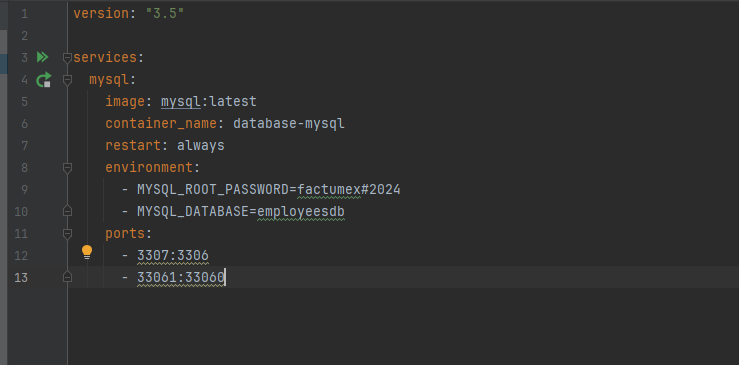
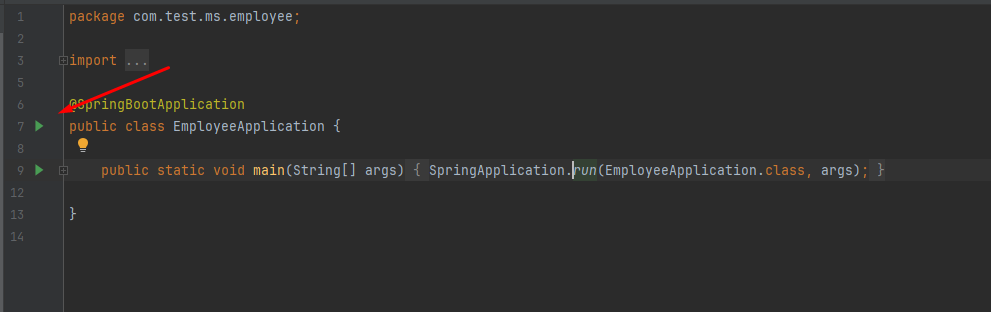
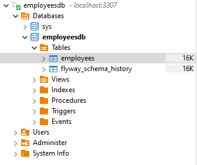
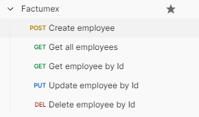
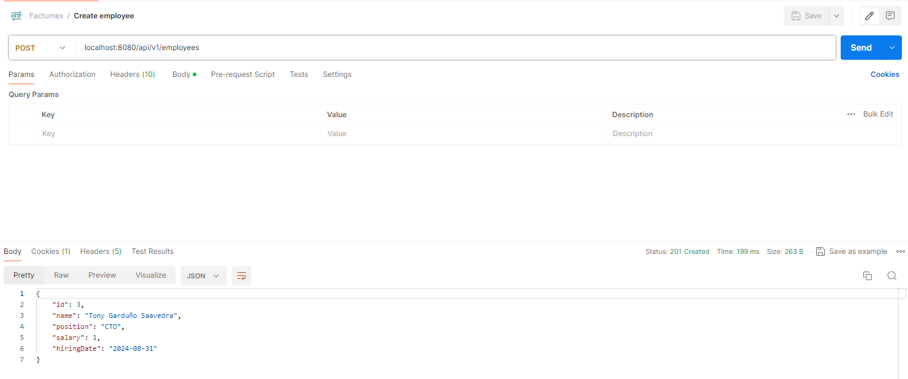

# Documentación

## Índice
1. Ejecución local


## Ejecución local

Las siguientes instrucciones pueden ser ejecutadas desde el IDE de su preferencia, sin embargo por practicidad de los 
comandos se haran en Intellij.

Abra el archivo database-compose.yml que se encuentra en la carpeta docker-release de la raíz del proyecto

<p align="center"></p>

Directamente desde este archivo puede ejecutar docker compose para descargar la imagen de Mysql
<br> o si lo desea puede ejecutar el siguiente comando:
```cmd 
 docker-compose database-compose.yml up -d
```
Esto descargara la imagen de MySQL y creara la base de datos employeesdb
 
A continuación ejecute el proyecto desde las opciones del IDE o puede hacerlo desde el archivo principal EmployeeApplication

<p align="center"></p>

Esto levantará el proyecto y si es la primera vez ejecutará las migraciones,<br> 
en este caso la creación de la tabla employees

<p align="center"></p>

Sirvase usar la colección json de peticiones http para probar la aplicación que se encuentra en la raíz de este proyecto
```cmd 
 Employee.postman_collection
```

<p align="center"></p>

Cree un nuevo empleado haciendo una petición http de tipo POST a 
```cmd 
 localhost:8080/api/v1/employees
```

<p align="center"></p>
